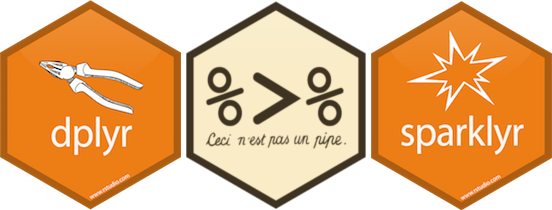

sparklyr_start 
===============================================================================

Materials to start using Spark in R (`sparklyr` package). 

- My slides for the [sparklyr workshop](https://aurora-mareviv.github.io/sparklyr_test) - updated July 2019.
    + In Spanish: [sparklyr workshop](https://aurora-mareviv.github.io/sparklyr_test/index_es)
- Examples for local usage (in RStudio):  [sparklyr_start.Rmd](https://github.com/aurora-mareviv/sparklyr_start/blob/master/sparklyr_start.Rmd).
    + Rendered in HTML [sparklyr_start.html](https://aurora-mareviv.github.io/sparklyr_start/sparklyr_start.html)
- Examples for cluster usage (in Jupyter): [sparklyr_test.ipynb](https://github.com/aurora-mareviv/sparklyr_start/blob/master/sparklyr_test.ipynb).
    + Rendered in [nbviewer.jupyter.org](http://nbviewer.jupyter.org/github/aurora-mareviv/sparklyr_start/blob/master/sparklyr_test.ipynb)

### Clone this repo

    $ git clone https://github.com/aurora-mareviv/sparklyr_start
    

## References 

#### Sparklyr

- [`sparklyr` workshop](https://github.com/aurora-mareviv/sparklyr_start)
- [`sparklyr` presentation by RStudio](https://cdn.oreillystatic.com/en/assets/1/event/193/Sparklyr_%20An%20R%20interface%20for%20Apache%20Spark%20Presentation.pdf)
- [`sparklyr` tutorial](http://spark.rstudio.com/).
- [`sparklyr` cheatsheet](https://www.rstudio.com/resources/cheatsheets/#sparklyr).
- [`sparklyr`: creating extensions](http://spark.rstudio.com/extensions.html).
- [Differences between `sparkr` and `sparklyr`](https://stackoverflow.com/questions/39494484/sparkr-vs-sparklyr).
- [Hive Operators and UDFs](https://cwiki.apache.org/confluence/display/Hive/LanguageManual+UDF).
- [String Functions in Hive](http://www.folkstalk.com/2011/11/string-functions-in-hive.html).
- [POSIX regular expressions](https://www.postgresql.org/docs/9.4/static/functions-matching.html#FUNCTIONS-POSIX-REGEXP).

#### PySpark

- [PySpark course](https://github.com/javicacheiro/pyspark_course)
- [Material for Machine Learning Workshop Galicia 2016](http://nbviewer.jupyter.org/github/javicacheiro/machine_learning_galicia_2016/blob/master/notebooks/sentiment_analysis-amazon_books.ipynb).
- [PySpark Programming Guide](https://spark.apache.org/docs/0.9.0/python-programming-guide.html).
- [PySpark cheatsheet](https://s3.amazonaws.com/assets.datacamp.com/blog_assets/PySpark_SQL_Cheat_Sheet_Python.pdf).

#### Jupyter
- [Jupyter shortcuts](https://www.dataquest.io/blog/jupyter-notebook-tips-tricks-shortcuts/)